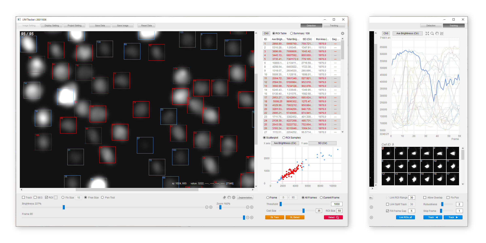

# LIM Tracker

LIM Tracker is a cell tracking software that has been developed for simple operation and high versatility. This software has a conventional tracking function consisting of recognition processing and link processing, a sequential search-type tracking function based on pattern matching, and a manual tracking function. LIM Tracker enables the seamless use of these functions. In addition, the system incorporates a highly interactive and interlocking data visualization method, which displays the analysis results in real-time, making it possible to flexibly correct the data and reduce the burden of tracking work. Moreover, recognition functions with deep learning (DL) are also available, which can be used for a wide range of targets, including stain-free images. <br>**LIM Tracker is implemented as a plugin for ImageJ/Fiji**.
### Key features
- LIM Tracker efficiently obtains accurate data using automatic and manual tracking.
- It rapidly checks for data accuracy with the interactive data visualization method.
- It enables flexible and simple modification of analysis results.
- Morphological changes can also be measured by segmentation processing.
- Recognition functions with deep learning are also available.

### Demo movie
-  **Cell Recognition (non-DL) & Link-type Tracking**

https://user-images.githubusercontent.com/91453257/167635380-71d12d78-d080-4fed-9477-3e7a60e44e2e.mp4
<br>

-  **Sequential Search-type Tracking** 

https://user-images.githubusercontent.com/91453257/167635404-9649f68f-af31-4053-9c07-96bce9b9f4bd.mp4
<br>


### Fiji plugin installation (Windows10)

1. Install Fiji itself, and copy the following folders & files contained in the FijiPlugin_win/plugins folder downloaded from this repository into the Fiji plugin folder (e.g., C:/Fiji.app/plugins ).
```bash
- LIMTrackerPluginExt
- LIMTrackerPlugin_.jar
```
2. Download [VC_redist.x64.exe (VisualC++ redistribution package)](https://aka.ms/vs/17/release/vc_redist.x64.exe) and double-click VC_redist.x64.exe to install it with default settings (If a DLL file is missing and an error occurs, please download and install [VisualC++ Redistributable Packages for Visual Studio 2013](https://microsoft.com/en-US/download/details.aspx?id=40784)).
### Fiji plugin installation (Ubuntu18.04) 

1. Install Fiji itself, and copy the following folders & files contained in the FijiPlugin_linux/plugins folder downloaded from this repository into the Fiji plugin folder (e.g., ${HOME}/Fiji.app/plugins ).
```bash
- LIMTrackerPluginExt
- LIMTrackerPlugin_.jar
```
2. Download [libopencv_core.so.4.3](https://drive.google.com/file/d/1cDnkx-b531rQ5mhB8F5PU9DAtuYr3cF1/view?usp=sharing) and [libopencv_imgproc.so.4.3](https://drive.google.com/file/d/1Yrz5hvsG2Seo_nxAORRxvIooSSGU9L8R/view?usp=sharing), and copy into Fiji's library folder (e.g., ${HOME}/Fiji.app/lib/linux64).


### How to launch the Fiji plugin

1. Launch Fiji and load the image file you want to track.
2. Select "Plugins/Tracking/LIM Tracker Plugin" from the Fiji menu. This will launch the plugin.

### How to use LIM Tracker
- #### See **[Quickstart Manual](Manual.pdf)** for details.

  
### Deep learning recognition service setup instructions
This software is equipped with a plugin mechanism to work with reference implementations (Python programs) of various deep learning recognition algorithms available on the web. 
This software can work in conjunction with the following implementations by setting. 
- [StarDist](https://github.com/stardist/stardist)
- [Cellpose](https://github.com/MouseLand/cellpose)
- [YOLACT++](https://github.com/dbolya/yolact)
- [Matterport MaskR-CNN](https://github.com/matterport/Mask_RCNN)
- [Detectron2 MaskR-CNN](https://github.com/facebookresearch/detectron2)

To use this function, nVIDIA GPU is required. 

- #### See **[setup instructions](README_DL.md)** for details.


### Extend functionality through plug-in mechanisms

-  A plugin mechanism is provided for the recognition function, and users can switch to their algorithm. Examples of plugin implementations of the recognition function using OpenCV are available in the [DetectPlugin](DetectPlugin) folder.

-  A plugin mechanism is provided to work with reference implementations of various deep learning recognition algorithms written in Python. Examples of plugin implementations are available in the [DLLinkPlugin](DLLinkPlugin) folder.

-  A plugin mechanism is provided for users to output and use the data analyzed by this software freely. Examples of plugin implementations are available in the [DataSavePlugin](DataSavePlugin) folder.

### Test dataset
Test images, project files, and GT images can be obtained from the following links.
-  [Case1](https://drive.google.com/file/d/1riAsEq6tMkKIP_tMu40O4R5rkenBEqPQ/view?usp=sharing)
-  [Case2](https://drive.google.com/file/d/18el_wbfBsBPE9qeXDsXCer2gh9tWC0cm/view?usp=sharing)
-  [Case3](https://drive.google.com/file/d/1MiJp4h3hsoduLei46g4zvW6N5Ktc1bTG/view?usp=sharing)
	


### Acknowledgments

LIM Tracker is powered by the following open source programs.
- SWT (https://www.eclipse.org/swt/)
- Eclipse nebula (https://www.eclipse.org/nebula/)
- OpenCV (https://opencv.org/)
- ITK (https://itk.org/)
- ImgLib2 (https://imagej.net/ImgLib2)
- ZeroMQ (https://zeromq.org/)

This software work in conjunction with the following reference implementations. 
- StarDist (https://github.com/stardist/stardist)
- Cellpose (https://github.com/MouseLand/cellpose)
- YOLACT++ (https://github.com/dbolya/yolact)
- Matterport MaskR-CNN (https://github.com/matterport/Mask_RCNN)
- Detectron2 MaskR-CNN (https://github.com/facebookresearch/detectron2)

### Citation
Aragaki, H., Ogoh, K., Kondo, Y. & Aoki, K. LIM Tracker: a software package for cell tracking and analysis with advanced interactivity. Sci Rep 12, 2702 (2022). https://doi.org/10.1038/s41598-022-06269-6
